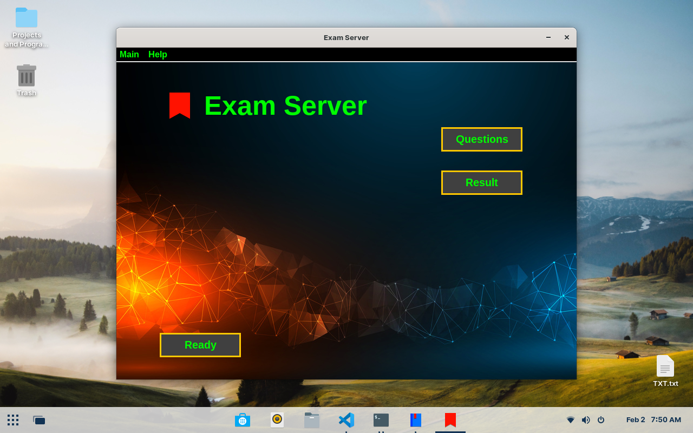
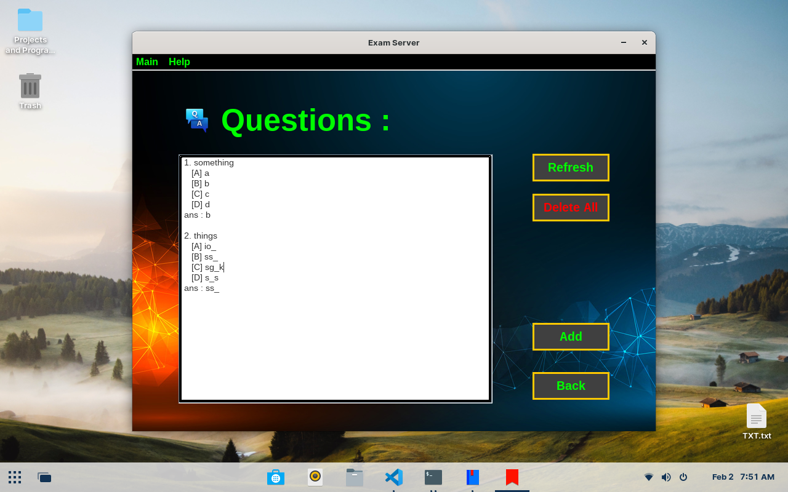
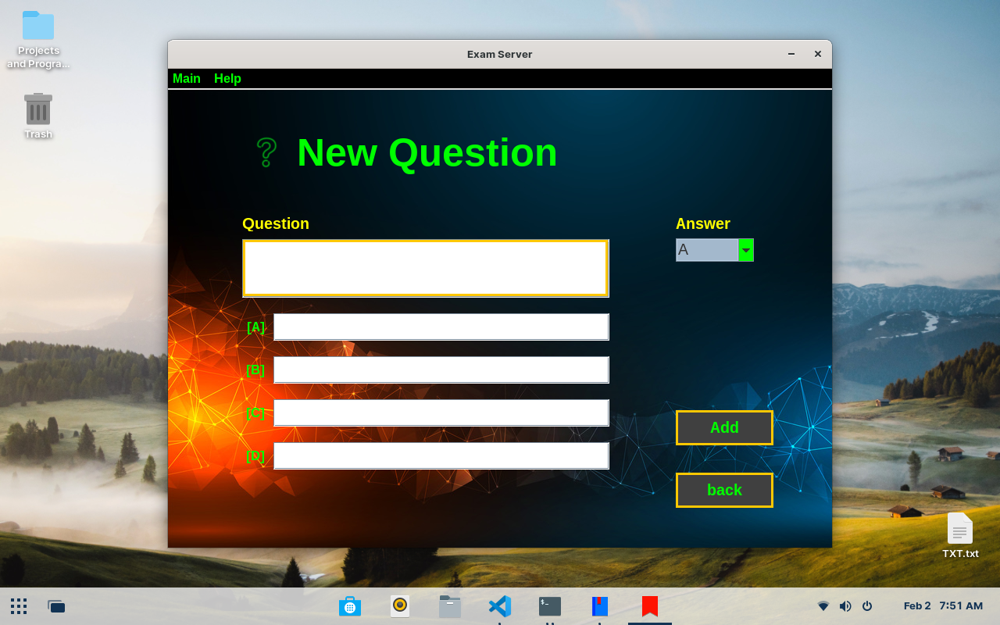
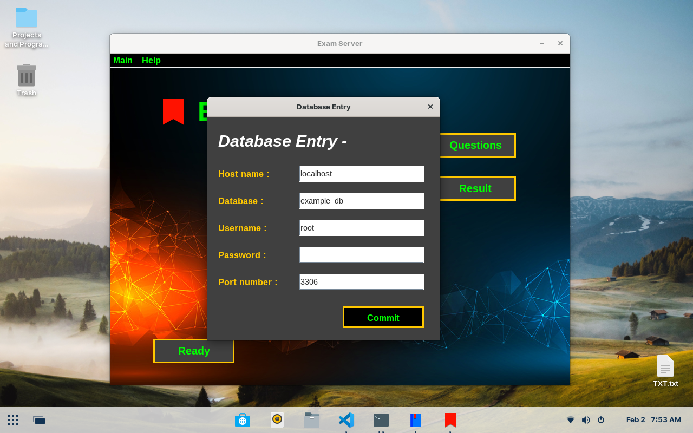
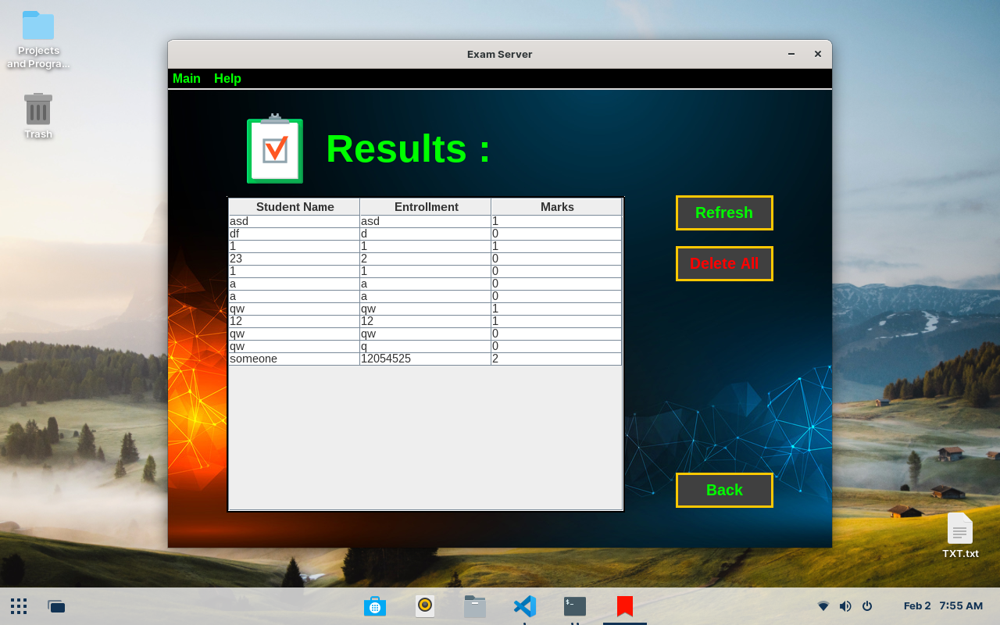
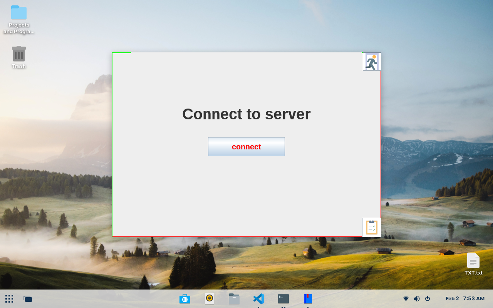
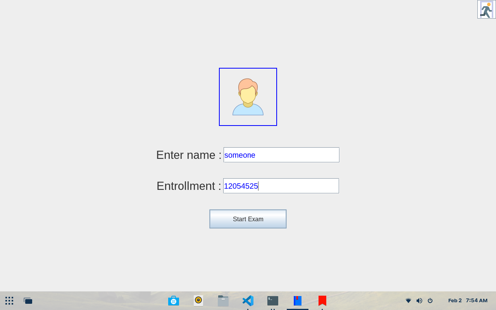
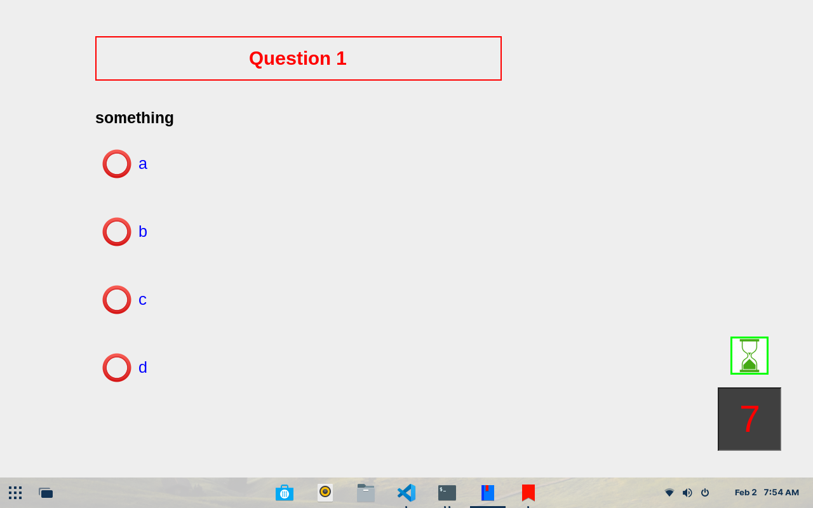
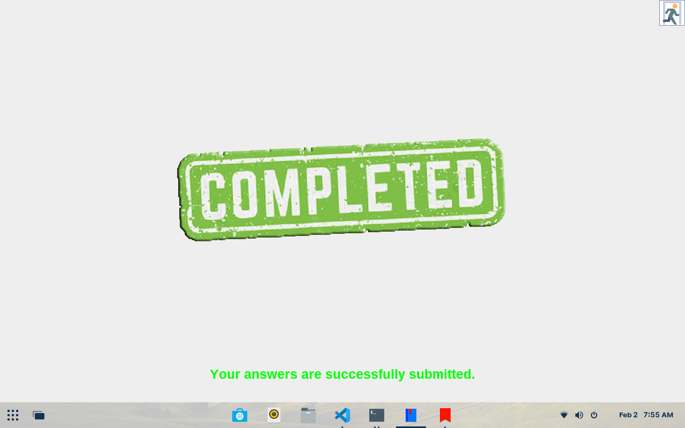

# Quiz-Maker
make simple quiz for fun. created in java swing. There are two panels admin panel who is able to see the result and also make quiz. Second is client-panel, where the exam is conducted.

## Technologies Used
1. Java swing
2. MySQL database   
3. Developed in Eclipse IDE


## How to use?

### 1) Run Directly
<b>Windows user : </b>To simply use this application just dubble click on 'CLIENT_RUNNER.jar' to work as a client or  dubble click on 'SERVER_RUNNER.jar' to work as an admin both are located on their corresponding folders.
<br>
<b>Linux user :</b>open terminal -> locate 'Quiz-Client' to work as a client and run the following command
```bash
java -jar 'CLIENT_RUNNER.jar'
```
or locate 'Quiz_Server' to work as an admin and run the following command
```bash
java -jar 'SERVER_RUNNER.jar'
```

<br><br>
you also need to <a href="#scroll">configur database</a>.

### 2) Run with Code

 <b>Step-1 :</b> After downloading, you have to keep this project on your workspace. Check your workspace from Eclipse OR you can also change your workspace by <br>
   <b>file->SwitchWorkspace->Other</b>
   and choose your workspace.

<b>Step-2 :</b> Open eclipse IDE : 
     <i>go to file->Open Project from file system-> locate your workspace and select the project(Quiz-Maker) folder -> click on open -> finish</i> <br>
     this will open the both the client and server

<b>Step-3 :</b> Here you also need to fix the build path problem : To do that <br>
 <i>right click on Quiz-Client -> Build Path -> Configure Build Path -> under the Libraries tab -> Classpath -> click on mysql-connector-j-8.0.32.jar and Remove It because you need to re-add this in order to run your project</i>

 <br>
 after removeing click on Classpath -> Add External jars -> locate jar file (Quiz-Maker/Quiz_Client/mysql-connector-j-8.0.32.jar) and ADD it

 <br><br>You need to step 3 again for Quiz-Server and the path where the jar is located is <b>(Quiz-Maker/Quiz_Server/mysql-connector-j-8.0.32.jar).</b><i> ------- the both jars are same, so you can mix them without any fear ------- </i>

<b>Step-4 :</b> After configuring build path you are able to run this application to run this, right click on project(Quiz_Server or Quiz_Client) -> Run As -> Java Application 

<b>Step-5 :</b> Thanks for reading this.

## Database<span id="scroll"></span> configuration 

To configure the database the passwords are :<br>
 For client ==> EXAM@CLIENT<br>
 For server ==> EXAM@SERVER<br>
<br>
you need to have mysql installed in your Computer
create database for this project you can use any name
<br>
You need to configure both Client and Admin with database <br>
1. To configure admin run Admin panel ->Main->Database Entry<br>
2. To configure client run client panel -> on the right-bottom corner you can see an icon click on it<br>

<br>HOSTNAME - if you are using mysql in your computer this should be <b>localhost</b>
<br>DATABASE - enter your database name here if you don't have one, -- create it 
<br>USERNAME - enter your username, mysql has default username of <b>root</b>
<br>PASSWORD - enter your database password here, mysql has default password nothing, you don't need to fill this 
<br>PORT - if you are using mysql this should be <b>3306</b>
<br><br>
after filling these details click on commit

## Images

### Admin Panel
  

<div style="display: flex;flex-direction: column; grid-gap: 10px;">
    <div style="display: flex; grid-gap: 10px;">
        
        
    </div>
    <div style="display: flex; grid-gap: 10px;">
        
        
    </div>
      <div style="display: flex; grid-gap: 10px;">
        
    </div>
</div>


### Client Panel
  

<div style="display: flex;flex-direction: column; grid-gap: 10px;">
    <div style="display: flex; grid-gap: 10px;">
        
        
    </div>
      <div style="display: flex; grid-gap: 10px;">
        
        
    </div>
</div>


## Summery 

Just play with it ---- !